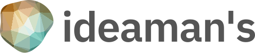
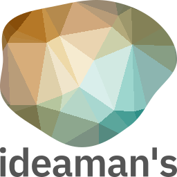
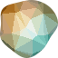

# アイデアマンズ ロゴマーク自動生成 v2

[アイデアマンズ株式会社](https://www.ideamans.com/)のロゴマークを自動生成するWebアプリケーションです。

ロゴマークは、`seed`パラメータとして渡した値に応じてランダムに変化します。

アイデアマンズ株式会社は、プログラミング技術による価値の創造を最大の強みとする企業です。そのコーポレートアイデンティティを表現するには、ロゴマークがプログラミングで作られるべきという考えに至りました。

## ロゴマークのタイプ

### インラインタイプ

マークの横に社名が表示される横長タイプです。

- エントリーポイント
  - `/v2/inline.svg` または `/v2/inline.png`
- パラメータ
  - `seed` マークのパターンを決めるランダムシード文字列です。デフォルト値は`alogorithm2`です。
  - `width` マークの幅です。デフォルト値は`512`です。高さは社名の長さに応じて決まります。
  - `colorTheme` 適応させるカラーテーマです。`light`または`dark`を指定できます。デフォルトは`light`です。

### 矩形タイプ

マークの下に社名が表示される矩形タイプです。正方形やOGP画像に利用します。

- エントリーポイント
  - `/v2/rect.svg` または `/v2/rect.png`
- パラメータ
  - `seed` マークのパターンを決めるランダムシード文字列です。デフォルト値は`alogorithm2`です。
  - `width` マークの幅です。デフォルト値は`512`です。
  - `height` マークの高さです。デフォルト値は`width`を参照します。
  - `colorTheme` 適応させるカラーテーマです。`light`または`dark`を指定できます。デフォルトは`light`です。

### アイコンタイプ

マークだけが表示されるタイプです。主にFaviconに使用します。以下のパラメータを指定できます。

- エントリーポイント
  - `/v2/icon.svg` または `/v2/icon.png`
- パラメータ
  - `seed` マークのパターンを決めるランダムシード文字列です。デフォルト値は`alogorithm2`です。
  - `width` マークの幅です。デフォルト値は`64`です。
  - `height` マークの高さです。デフォルト値は`width`を参照します。

## パターン生成

[trianglify](https://www.npmjs.com/package/trianglify)で幾何学パターンを生成し、[blobs](https://www.npmjs.com/package/blobs)でそれをクリッピングしています。
